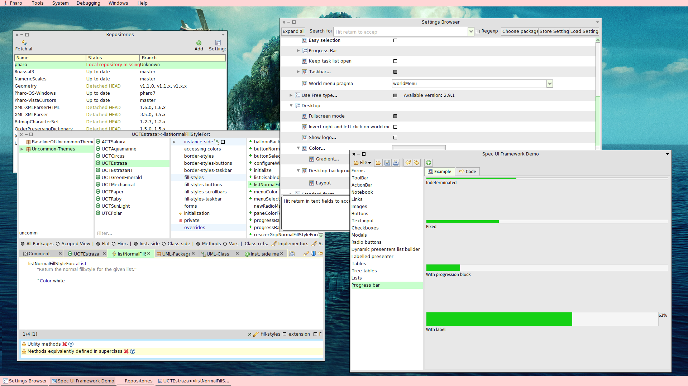

# Uncommon-Themes

These are a little collection of themes made by me (David Sánchez Gregori) for the Pharo IDE.

This is tested on `Pharo 8` and (in the moment of publishing) latest `Pharo 9`.

To load the package:


Execute from the `Playground` or the `Workspace`:
```smalltalk
Metacello new 
	repository: 'github://David5i6/Uncommon-Themes/src';
	baseline: 'UncommonThemes';
	load 	
```

Then go to *Settings* and select a "Uncommon Theme".

## Themes

Here is a list of themes with ans screenshot of them.

### Aquamarine


### Gold


### Circus


### Emerald



### Mechanic


### Paper


### Polar


### Ruby


### Sakura


### Silver


### Straza


### Straza NT

The same as Straza but without transparency.


### Sunlight

